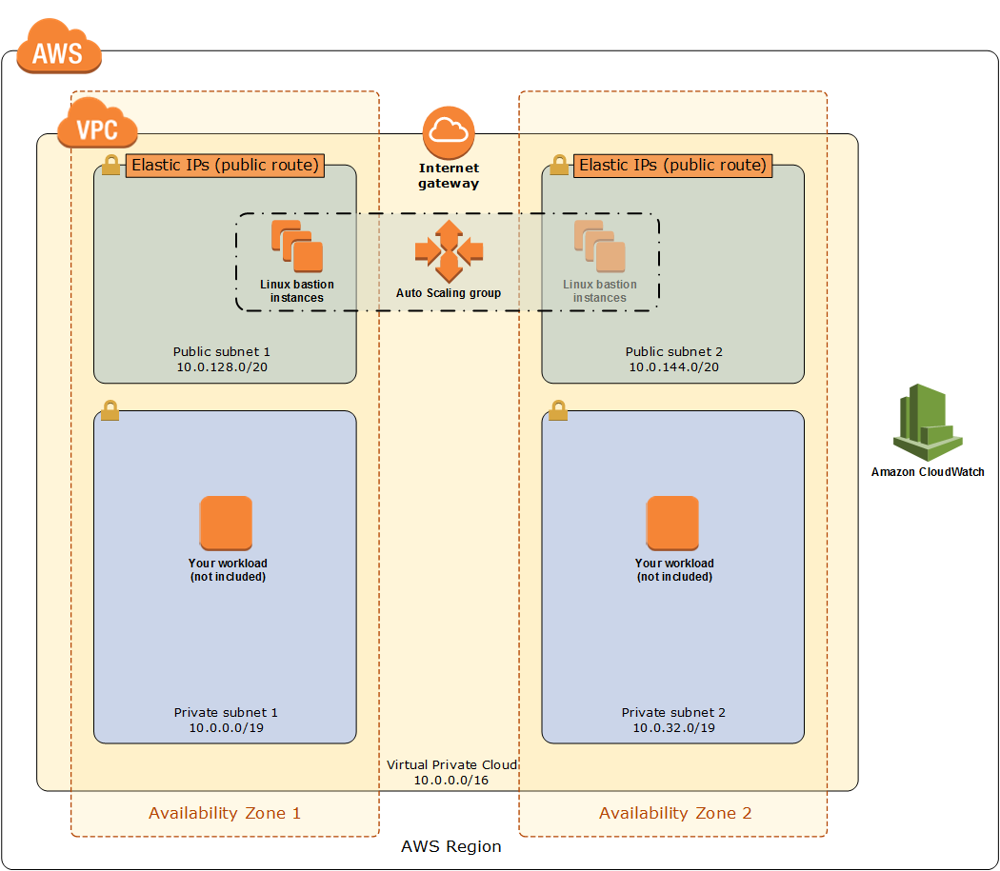

# SSH Tunneling with Ease

In this post, I'll show you how to use the OpenSSH `ProxyJump` command in your SSH Config file for easier SSH tunneling to your instances on private subnets.

## SSH Bastion Hosts

For security reasons, most of your EC2 instances should be on private subnets,
inaccessible from the Internet. But likely you will still need to SSH to your instances to
manage or troubleshoot them. Bastion hosts provide a hardened, auditable entry
point to access your EC2 instances on private subnets. AWS has an excellent reference architecture for
[Linux Bastion
Hosts](https://docs.aws.amazon.com/quickstart/latest/linux-bastion/welcome.html).
I recommend this reference architecture if you need SSH bastion hosts
in your AWS account.

## Bastion Host Architecture



## Easier SSH tunneling

The SSH bastion host provides a way to access your EC2 instances on private
subnets by jumping through the bastion host to your target EC2 instance. Most
people SSH into the bastion host and then SSH from the bastion host to the
target EC2 instance, a tedious, two-step process. You can also set up an SSH
tunnel as a one-liner, but it's tricky to get right. OpenSSH 7.3, released in
August 2016, provides a [`ProxyJump` command](https://en.wikibooks.org/wiki/OpenSSH/Cookbook/Proxies_and_Jump_Hosts) which makes it trivial to directly tunnel through the bastion host to your target host (instance). Your connection is still logged by the bastion host, so you're not bypassing any security measures. It's just much quicker.

## ProxyJump on the Command Line

You can use `ProxyJump` on the command line with the `-J` flag. This is useful for one-off connections through the bastion host to target EC2 instances on private subnets.

The command takes this form: `ssh -J user@bastion user@target-ec2-instance`, e.g.

```shell
ssh -J ec2-user@mybastion.example.com admin@ip-10-0-0-5.ec2.internal
```

## ProxyJump In Your SSH Config File

For more permanent connections you can add an entry to your [SSH Config file](https://www.ssh.com/ssh/config/). For example:

```shell
Host mywebserver
    HostName ip-10-0-0-5.ec2.internal
    User admin
    ProxyJump ec2-user@mybastion.example.com
```

You can now connect to your `mywebserver` instance (through the bastion) like this:

```shell
ssh mywebserver
```

In the example above, we are connecting through the bastion host to `admin@ip-10-0-0-5.ec2.internal` which is an EC2 Linux instance on a private subnet.

## New – AWS Systems Manager Session Manager for Shell Access to EC2 Instances

Of course, with the solution above, you still have to distribute and manage SSH keypairs. If you want to avoid this hassle, AWS recently announced an alternative for secure shell access. If you have the SSM Agent installed on all your instances you can use the [SSM Session Manager](https://aws.amazon.com/blogs/aws/new-session-manager/) for secure shell access. As an added bonus, it even works with Microsoft Windows servers, providing an interactive PowerShell session.

## Summary

In this post I showed you how to use the SSH `ProxyJump` command to easily tunnel through a bastion host to target EC2 instances. I've personally used the SSH `ProxyJump` command with several customers to make jumping through a bastion host much easier, quicker, and more reliable.

If you are interested in learning more about how 1Strategy can help optimize your AWS cloud journey and infrastructure, please contact us for more information at info@1Strategy.com.